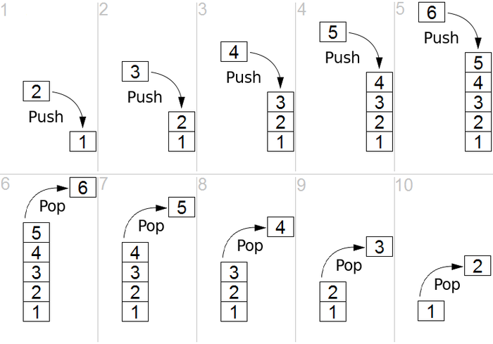

# 翻书问题或者走台阶问题：
- 共有n个台阶，每次只能上1个台阶或者2个台阶，共有多少种方法爬完台阶。
- 共有n页书，每次只能翻1页或者2页书，共有多少种方法翻完全书。

```py
# f(n)为翻完全书的方法
# 递归写法
def f(n):
    if n == 1:
        return 1
    if n == 2:
        return 2
    if n > 2:
        return f(n - 1) + f(n - 2)

# 迭代写法，或者叫循环写法
def f(n):
    res = [0 for i in range(n + 1)]
    res[1] = 1
    res[2] = 2
    for i in range(3, n+1):
        res[i] = res[i - 1] + res[i - 2]
    return res[n]
    
    
# 使用缓存
cache = {}
def fib(n):
    if n not in cache.keys():
        cache[n] = _fib(n)
    return cache[n]

def _fib(n):
    if n == 1 or n == 2:
        return n
    else:
        return fib(n-1) + fib(n-2)
            
```

# 二分查找

```py
def LinearSearch(array, t):
    for i in range(len(array)):
        if array[i] == t:
            return True
    return False


def BinarySearch(array, t):
    left = 0
    right = len(array) - 1
    while left <= right:
        mid = int((left + right) / 2)
        if array[mid] < t:
            left = mid + 1
        elif array[mid] > t:
            right = mid - 1
        else:
            return True
    return False


array = list(range(100000000))


import time

t1 = time.time()
LinearSearch(array, 100000001)
t2 = time.time()
print('线性查找：', t2 - t1)

t3 = time.time()
BinarySearch(array, 100000001)
t4 = time.time()
print('二分查找：', t4 - t3)
```

## 二分查找例题（变种）

### 题意

```py
[
  [1,   3,  5,  7],
  [10, 11, 16, 20],
  [23, 30, 34, 50]
]

查找比如16在不在矩阵中。
```

### 解法
```py
class Solution:
    # @param matrix, a list of lists of integers
    # @param target, an integer
    # @return a boolean
    def searchMatrix(self, matrix, target):
        i = 0
        j = len(matrix[0]) - 1
        while i < len(matrix) and j >= 0:
            if matrix[i][j] == target:
                return True
            elif matrix[i][j] > target:
                j -= 1
            else:
                i += 1
        return False
```

# 链表

链表中最简单的一种是单向链表，它包含两个域，一个信息域和一个指针域。这个链接指向列表中的下一个节点，而最后一个节点则指向一个空值。


## python代码

```py
# 链表中的节点的数据结构
class ListNode(object):
    def __init__(self, x):
        self.val = x
        self.next = None

# 实例化
A = ListNode('a')
B = ListNode('b')
C = ListNode('c')
A.next = B
B.next = C

# 这样，一条链表就形成了。
# 'a' -> 'b' -> 'c'

# 遍历链表
tmp = A
while tmp != None:
    print(tmp.val)
    tmp = tmp.next

# 递归遍历链表
def listorder(head):
    if head:
        print(head.val)
        listorder(head.next)

listorder(A)
```

## 例题

翻转一条单向链表。

例子：

```
Input: 1->2->3->4->5->NULL
Output: 5->4->3->2->1->NULL
```

解答：

```py
# Definition for singly-linked list.
class ListNode(object):
    def __init__(self, x):
        self.val = x
        self.next = None

class Solution(object):
    def reverseList(self, head):
        """
        :type head: ListNode
        :rtype: ListNode
        """
        dummy = head
        tmp = dummy
        
        while head and head.next != None:
            dummy = head.next
            head.next = dummy.next
            dummy.next = tmp
            tmp = dummy
        return dummy
        
head = ListNode(1)
head.next = ListNode(2)
head.next.next = ListNode(3)
head.next.next.next = ListNode(4)
head.next.next.next.next = ListNode(5)

solution = Solution()
reverse_head = solution.reverseList(head)
tmp = reverse_head
while tmp:
    print(tmp.val)
    tmp = tmp.next
```

# 二叉树


## python代码

```py
class TreeNode(object):
    def __init__(self, x):
        self.val = x
        self.left = None
        self.right = None

root = TreeNode(1)
root.left = TreeNode(2)
root.right = TreeNode(3)

'''
         1
        / \
       2   3
'''

# root就是一颗二叉树
```

## 中序遍历(先遍历左子树，再遍历根节点，再遍历右子树)

```py
# class TreeNode:
#     def __init__(self, x):
#         self.val = x
#         self.left = None
#         self.right = None

def inorder(root):
    if root:
        inorder(root.left)
        print(root.val)
        inorder(root.right)
```

## 前序遍历(先遍历根节点，再遍历左子树，再遍历右子树)

```py
class TreeNode:
    def __init__(self, x):
        self.val = x
        self.left = None
        self.right = None

def preorder(root):
    if root:
        print(root.val)
        preorder(root.left)
        preorder(root.right)

root = TreeNode(1)
root.left = TreeNode(2)
root.right = TreeNode(3)
preorder(root)
```

## 后序遍历(先遍历左子树，再遍历右子树，再遍历根节点)

```py
# class TreeNode:
#     def __init__(self, x):
#         self.val = x
#         self.left = None
#         self.right = None

def postorder(root):
    if root:
        postorder(root.left)
        postorder(root.right)
        print(root.val)
```

## 测试程序

```py
class TreeNode:
    def __init__(self, x):
        self.val = x
        self.left = None
        self.right = None

def preorder(root):
    if root:
        print(root.val)
        preorder(root.left)
        preorder(root.right)

def inorder(root):
    if root:
        inorder(root.left)
        print(root.val)
        inorder(root.right)

def postorder(root):
    if root:
        postorder(root.left)
        postorder(root.right)
        print(root.val)

root = TreeNode(1)
root.left = TreeNode(2)
root.right = TreeNode(3)
root.left.left = TreeNode(4)
root.left.right = TreeNode(5)
root.right.left = TreeNode(6)
root.right.right = TreeNode(7)

preorder(root)
inorder(root)
postorder(root)
```

## 已知一颗二叉树的先序遍历序列为ABCDEFG，中序遍历为CDBAEGF，能否唯一确定一颗二叉树？如果可以，请画出这颗二叉树。

```
            A
           / \
          B   E
         /     \
        C       F
         \     /
          D   G

    先序遍历: ABCDEFG
    中序遍历: CDBAEGF
    后序遍历: DCBGFEA
```

使用程序根据二叉树的先序遍历和中序遍历来恢复二叉树。

```py
class TreeNode:
    def __init__(self, x):
        self.val = x
        self.left = None
        self.right = None

def buildTree(preorder, inorder):
    if len(preorder) == 0:
        return None
    if len(preorder) == 1:
        return TreeNode(preorder[0])
    root = TreeNode(preorder[0])
    index = inorder.index(root.val)
    root.left = buildTree(preorder[1 : index + 1], inorder[0 : index])
    root.right = buildTree(preorder[index + 1 : len(preorder)], inorder[index + 1 : len(inorder)])
    return root

preorder_string = 'ABCDEFG'
inorder_string = 'CDBAEGF'

r = buildTree(preorder_string, inorder_string)
preorder(r)
inorder(r)
postorder(r)
```

# 栈和队列

## 栈



python实现

```py
class Stack(object):
    def __init__(self):
        self.stack = []
    def pop(self):
        if self.is_empty():
            return None
        else:
            return self.stack.pop()
    def push(self,val):
        return self.stack.append(val)
    def peak(self):
        if self.is_empty():
            return None
        else:
            return self.stack[-1]
    def size(self):
        return len(self.stack)
    def is_empty(self):
        return self.size() == 0

s = Stack()
s.push(1)
s.peak()
s.is_empty()
s.pop()
```

## 队列


python实现

```py
class Queue(object):
    def __init__(self):
        self.queue = []
    def enqueue(self,val):
        self.queue.insert(0,val)
    def dequeue(self):
        if self.is_empty():
            return None
        else:
            return self.queue.pop()
    def size(self):
        return len(self.queue)
    def is_empty(self):
        return self.size() == 0

q = Queue()
q.enqueue(1)
q.is_empty()
q.dequeue()
```

## 使用队列模拟栈。

```py
class StackByQueue(object):
    def __init__(self):
        self.stack = Queue()
    def push(self, val):
        self.stack.enqueue(val)
    def pop(self):
        for i in range(self.stack.size() - 1):
            value = self.stack.dequeue()
            self.stack.enqueue(value)
        return self.stack.dequeue()
```

## 使用栈模拟队列

```py
class QueueByStack(object):
    def __init__(self):
        self.queue1 = Stack()
        self.queue2 = Stack()
    def enqueue(self, val):
        self.queue1.push(val)
    def dequeue(self):
        for i in range(self.queue1.size() - 1):
            value = self.queue1.pop()
            self.queue2.push(value)
        res = self.queue1.pop()
        for i in range(self.queue2.size()):
            value = self.queue2.pop()
            self.queue1.push(value)
        return res
```

# 插入排序

```py
def insertSort(A):
    for j in range(1, len(A)):
        key = A[j]
        i = j - 1
        while i >= 0 and A[i] > key:
            A[i + 1] = A[i]
            i = i - 1
        A[i + 1] = key
    return A

A = [5, 2, 4, 6, 1, 3]

print(insertSort(A))

```

```js
function insertSort(A) {
    for (j = 1; j < A.length; j++) {
        var key = A[j];
        var i = j - 1;
        while (i >= 0 && A[i] > key) {
            A[i + 1] = A[i];
            i = i - 1;
        }
        A[i + 1] = key;
    }
    return A;
}

var A = [5, 2, 4, 6, 1, 3];

console.log(insertSort(A));

```

# 快速排序

```py
def partition(A, p, r):
    x = A[r]
    i = p - 1
    for j in range(p, r):
        if A[j] <= x:
            i = i + 1
            A[i], A[j] = A[j], A[i]
    A[i + 1], A[r] = A[r], A[i + 1]
    return i + 1

def quickSort(A, p, r):
    if p < r:
        q = partition(A, p, r)
        quickSort(A, p, q - 1)
        quickSort(A, q + 1, r)

A = [2, 8, 7, 1, 3, 5, 6, 4]

quickSort(A, 0, 7)
print(A)
```

## 时间复杂度

```
假设快速排序的时间复杂度为f(N)
f(N) = 2 * f(N / 2) + O(N)
f(N) = 2 * (2 * f(N / 4) + O(N/2)) + O(N)
...
f(1) = O(1)
所以f(N) = O(NlogN)
```

# 在数组元素数量为n的数组里面寻找第k大的数

```py
def partition(A, p, r):
    x = A[r]
    i = p - 1
    for j in range(p, r):
        if A[j] >= x:
            i = i + 1
            A[i], A[j] = A[j], A[i]
    A[i + 1], A[r] = A[r], A[i + 1]
    return i + 1
    
def findKthLargest(A, p, r, k):
    if p <= r:
        q = partition(A, p, r)
        if k - 1 == q:
            return A[q]
        elif k - 1 < q:
            return findKthLargest(A, p, q - 1, k)
        else:
            return findKthLargest(A, q + 1, r, k)

A = [2, 8, 7, 1, 3, 5, 6, 4]

ret = findKthLargest(A, 0, 7, 8)

print('ret: ', ret)

```
